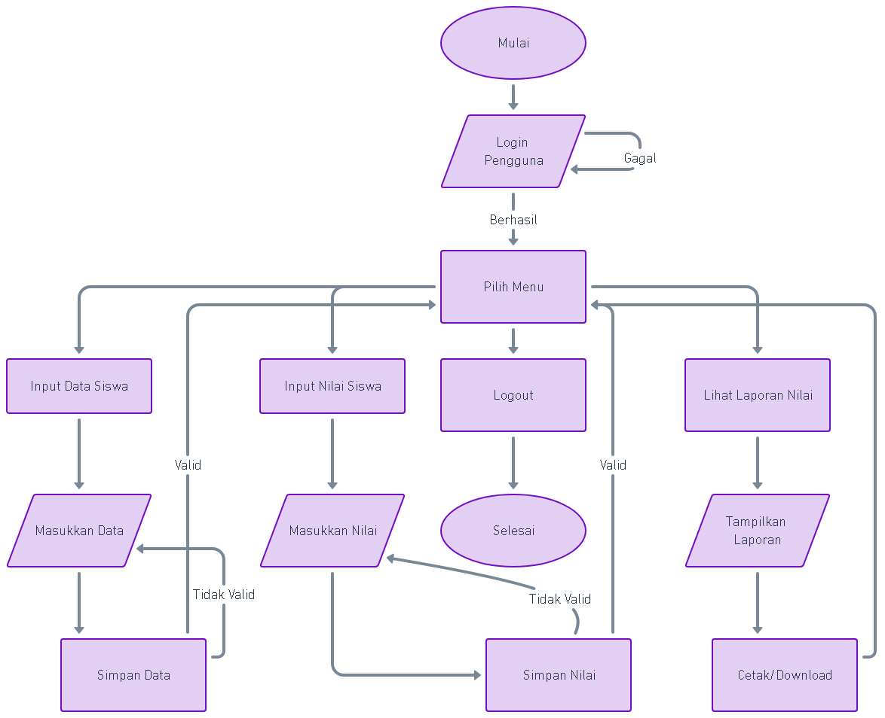
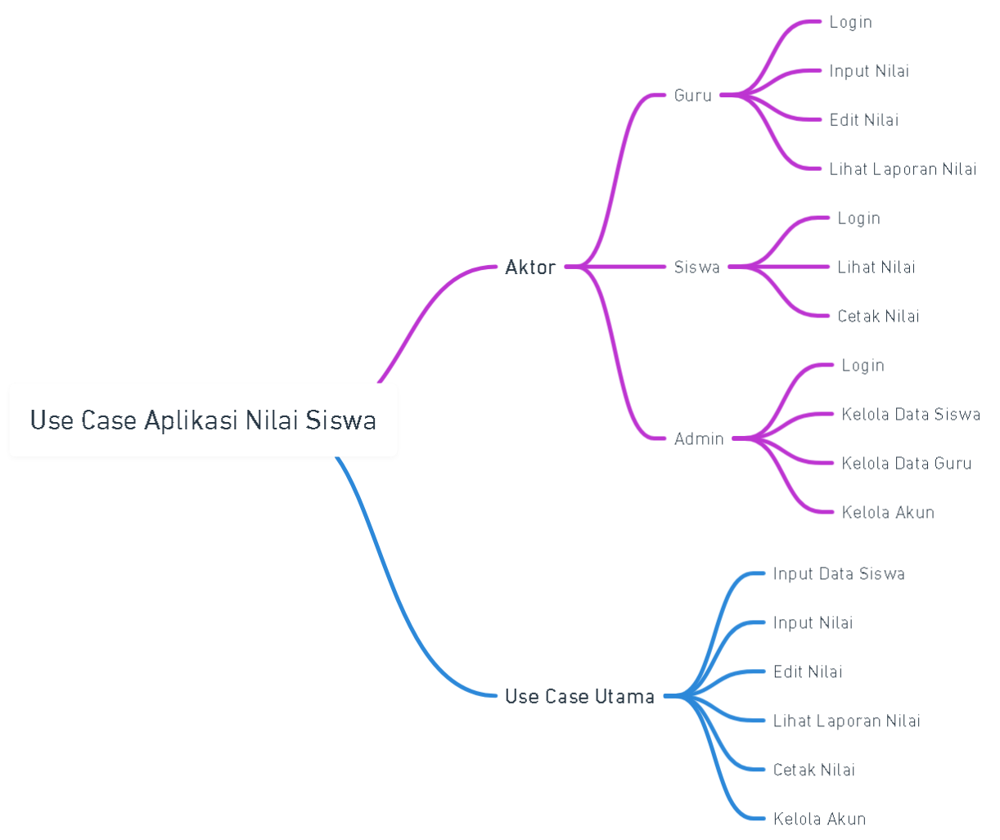
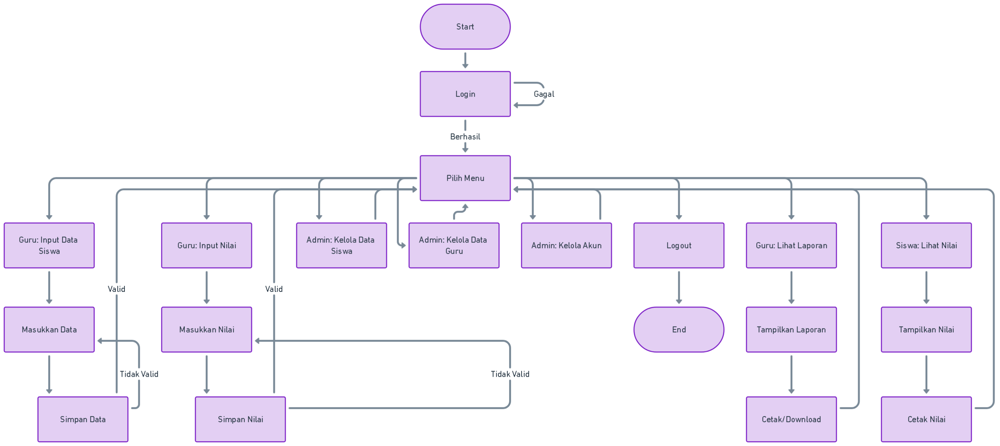
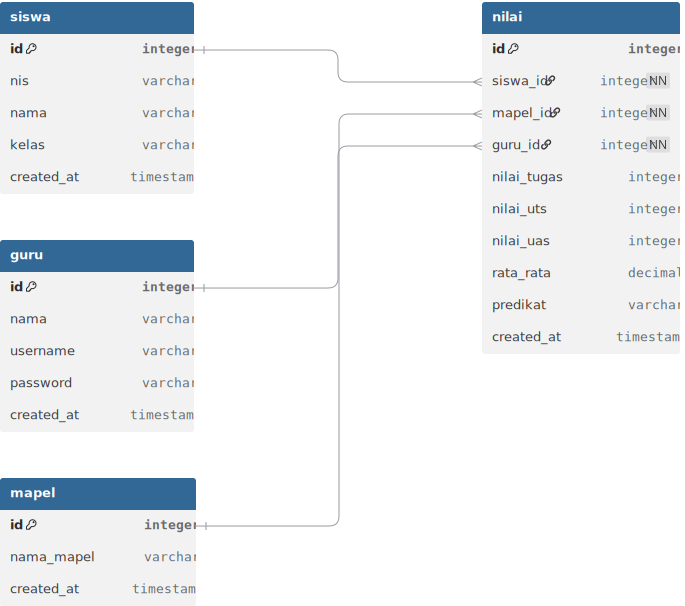

# 🎓 Aplikasi Nilai Siswa

Selamat datang di **Aplikasi Nilai Siswa** — solusi digital untuk pengelolaan data siswa dan nilai secara efisien!  
Aplikasi ini dirancang untuk memudahkan guru atau admin dalam mencatat nilai, menghitung rata-rata, memberi predikat, dan mencetak laporan hasil belajar siswa.

---

## 🚀 Fitur Unggulan

✅ Login user (guru/admin)  
✅ Input data siswa  
✅ Input nilai mata pelajaran  
✅ Hitung rata-rata dan tentukan predikat  
✅ Simpan ke database  
✅ Cetak dan tampilkan hasil nilai siswa  

---

## 📁 Struktur Proyek

---

## 🧭 Flowchart Sistem

Berikut diagram alur aplikasi, dari login hingga proses cetak nilai:

📌 *File flowchart tersedia dalam format PNG di folder `/flowchart`.*

---

## 🧭 UseCase Sistem

Berikut diagram alur aplikasi, dari login hingga proses cetak nilai:

📌 *File flowchart tersedia dalam format PNG di folder `/flowchart`.*

---

**

## 🧭 Activity Sistem

Berikut diagram alur aplikasi, dari login hingga proses cetak nilai:

📌 *File flowchart tersedia dalam format PNG di folder `/flowchart`.*

---

## 🧭 DbDiagram Sistem

Berikut diagram alur database aplikasi, dari login hingga proses cetak nilai:

📌 *File flowchart tersedia dalam format SVG di folder `/flowchart`.*

## 🛠️ Teknologi yang Digunakan

- **Frontend:** HTML, CSS, JavaScript  
- **Backend:** PHP  
- **Database:** MySQL  

---
