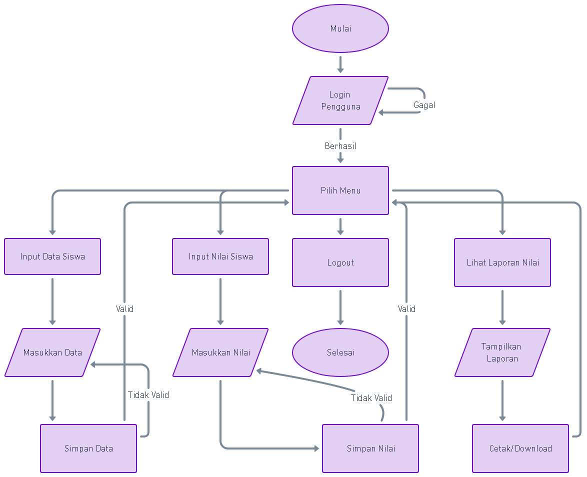
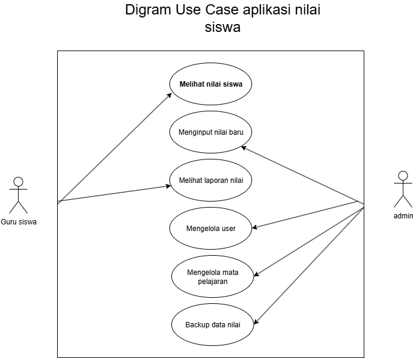
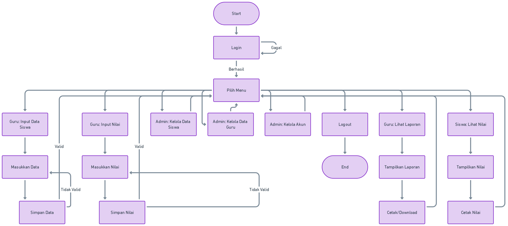
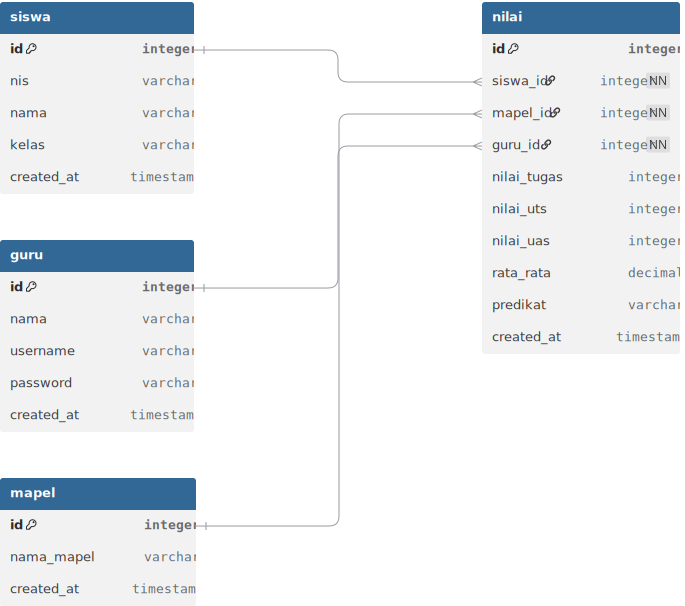
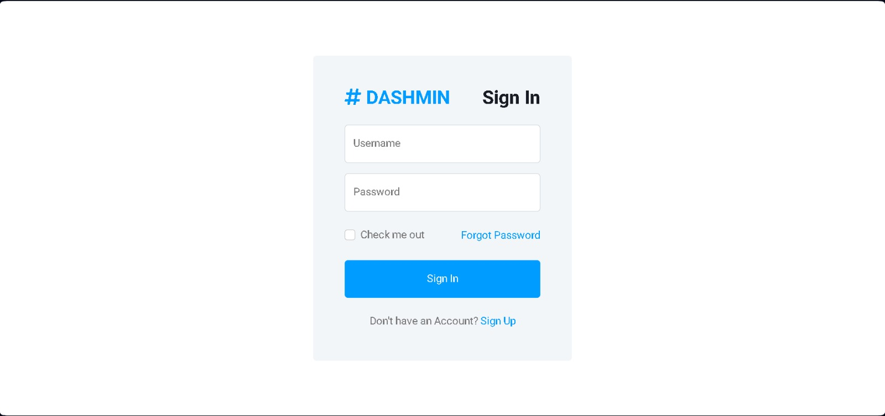
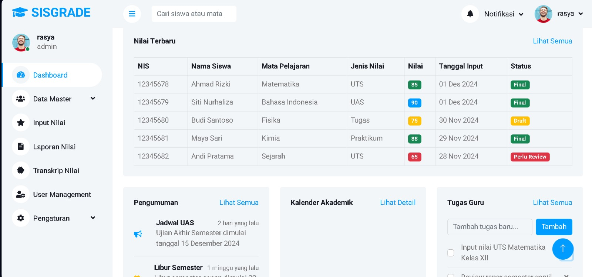
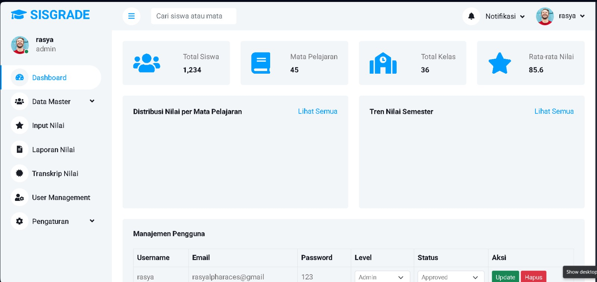

---

## 🧭 Flowchart Sistem  

Berikut gambaran alur sistem mulai dari login hingga cetak nilai:  

  

---

## 🧭 Use Case Diagram  

Menunjukkan interaksi antara **aktor (Guru/Admin)** dengan sistem:  

  

---

## 🧭 Activity Diagram  

Proses aktivitas dari login, input data, hingga cetak laporan:  

  

---

## 🧭 Database Diagram  

Struktur database aplikasi:  

  

**Tabel Utama:**  
- `users` → menyimpan data admin/guru  
- `siswa` → data siswa  
- `mapel` → daftar mata pelajaran  
- `nilai` → nilai per siswa per mapel  
- `laporan` → rekap hasil belajar  

---

## 🛠️ Teknologi yang Digunakan  

- **Frontend:** HTML5, CSS3, JavaScript (Bootstrap / Tailwind)  
- **Backend:** PHP Native  
- **Database:** MySQL  
- **Tools Tambahan:** Draw.io (diagram), phpMyAdmin (DB Management), FPDF/Dompdf (export PDF)  

---

## 🌟 Keunggulan Aplikasi  

✅ Mudah digunakan (User-Friendly)  
✅ Cepat & responsif (Optimized Performance)  
✅ Aman dengan sistem login  
✅ Laporan siap cetak (PDF)  
✅ Dapat dikembangkan sesuai kebutuhan sekolah  

---

## 📸 Preview Tampilan  

### 🔑 Login Page  
Halaman login dengan role **Guru/Admin**.  
  

### 📊 Dashboard  
Menampilkan ringkasan jumlah siswa, nilai, dan laporan.  
 
 
---

## 📌 Rencana Pengembangan  

- [ ] Tambah fitur **import nilai dari Excel**  
- [ ] Tambah fitur **grafik nilai siswa**  
- [ ] Tambah **notifikasi otomatis** untuk siswa  
- [ ] Buat versi **mobile-friendly (responsive design)**  

---

